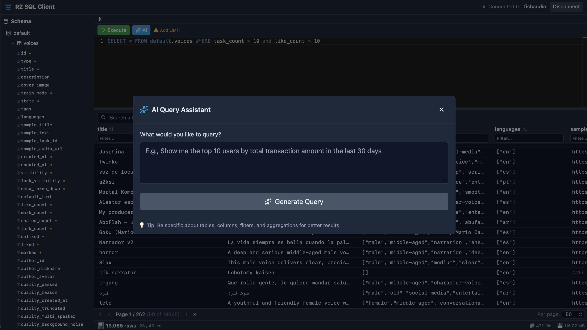

# R2 SQL Client 🚀

<div align="center">

[](https://tauri.app)
[](https://react.dev)
[](https://www.typescriptlang.org)
[](https://www.rust-lang.org)
[](LICENSE)
[](https://github.com/alexandregiordanelli/r2-sqlclient/releases)

**A powerful, modern desktop SQL client for Cloudflare R2 SQL with AI-powered query assistance**

[Features](#-features) • [Installation](#-installation) • [Screenshots](#-screenshots) • [Usage](#-usage)

</div>

---

## 🎯 Overview

R2 SQL Client is a **professional desktop application** that provides a DBeaver-style interface for querying Apache Iceberg tables in Cloudflare R2 Data Catalog using the R2 SQL HTTP API. Built with Tauri (Rust) and React for native performance and modern UX.

## 📸 Screenshot

<div align="center">



*DBeaver-style interface showing schema explorer, SQL editor with syntax highlighting, advanced data grid with sorting/filtering/pagination, and AI query assistant*

</div>

## Features

- ✅ **R2 SQL HTTP API Integration** - Direct connection to Cloudflare R2 SQL via REST API
- ✅ **Apache Iceberg Catalog Explorer** - Browse namespaces, tables, and schemas
- ✅ **SQL Editor** - Monaco Editor with syntax highlighting and Ctrl+Enter execution
- ✅ **Results Grid** - TanStack Table with virtual scrolling for large datasets
- ✅ **Connection Management** - Save and manage multiple R2 SQL connections
- ✅ **Dark Theme** - Modern dark UI with TailwindCSS

## Prerequisites

- **Node.js** 16.17.0 or higher
- **Rust** 1.70 or higher
- **pnpm** (recommended) or npm

## Installation

### Download Pre-built Binaries

Download the latest release from [GitHub Releases](https://github.com/alexandregiordanelli/r2-sqlclient/releases):

- **Linux**: `.deb` (Debian/Ubuntu) or `.AppImage` (universal)
- **macOS**: `.dmg` (Intel/Apple Silicon universal) - [⚠️ See macOS instructions](docs/MACOS_INSTALL.md)
- **Windows**: `.msi` or `.exe` installer

**macOS users**: The app is not code-signed. See [macOS Installation Guide](docs/MACOS_INSTALL.md) to bypass Gatekeeper.

### Build from Source

```bash
# Install dependencies
pnpm install

# Run in development mode
pnpm tauri dev

# Build for production
pnpm tauri build
```

## Configuration

To connect to R2 SQL, you'll need:

1. **Account ID** - Your Cloudflare account ID
2. **Bucket Name** - R2 bucket with Data Catalog enabled
3. **Catalog URI** - Format: `https://catalog.cloudflarestorage.com/{account_id}/{bucket_name}`
4. **API Token** - Cloudflare API token with permissions:
   - R2 SQL: read-only
   - R2 Data Catalog: read-only (or write)
   - R2 Storage: admin read/write

### Creating an API Token

1. Go to https://dash.cloudflare.com/profile/api-tokens
2. Click "Create Token" → "Custom Token"
3. Add permissions:
   - **Workers R2 SQL**: Read
   - **Workers R2 Data Catalog**: Write
   - **Workers R2 Storage**: Write
4. Select your account
5. Copy the token (only shown once!)

### Enabling R2 Data Catalog

```bash
# Login to Cloudflare
npx wrangler login

# Enable catalog on your bucket
npx wrangler r2 bucket catalog enable YOUR_BUCKET_NAME

# Get catalog URI and warehouse name
npx wrangler r2 bucket catalog get YOUR_BUCKET_NAME
```

## Usage

1. **Launch the app** - Run `pnpm tauri dev` or open the built app
2. **Click "Connect"** in the top-right corner
3. **Enter your credentials**:
   - Account ID
   - Bucket Name
   - Catalog URI
   - API Token
4. **Click "Connect"** - The schema explorer will load namespaces automatically
5. **Browse schema** - Click on namespaces to expand tables
6. **Click on a table** - View columns and data types
7. **Write SQL queries** in the editor:
   ```sql
   SELECT * FROM default.transactions LIMIT 10;
   ```
8. **Execute** - Press "Execute" button or `Ctrl/Cmd + Enter`
9. **View results** in the grid below

## API Endpoints

### R2 SQL Query API

```
POST https://api.sql.cloudflarestorage.com/api/v1/accounts/{ACCOUNT_ID}/r2-sql/query/{BUCKET_NAME}
Authorization: Bearer {API_TOKEN}
Content-Type: application/json

{
  "query": "SELECT * FROM namespace.table LIMIT 10;"
}
```

### Apache Iceberg REST Catalog API

```
GET https://catalog.cloudflarestorage.com/{account_id}/{bucket_name}/v1/namespaces
GET .../v1/namespaces/{namespace}/tables
GET .../v1/namespaces/{namespace}/tables/{table}
```

## Project Structure

```
r2-sqlclient/
├── src/                          # Frontend React
│   ├── components/
│   │   ├── ConnectionDialog.tsx  # Connection modal
│   │   ├── SchemaExplorer.tsx    # Sidebar tree
│   │   ├── QueryEditor.tsx       # SQL editor
│   │   └── ResultsGrid.tsx       # Results table
│   ├── stores/
│   │   ├── connectionStore.ts    # Connection state
│   │   ├── schemaStore.ts        # Schema explorer state
│   │   └── queryStore.ts         # Query execution state
│   └── App.tsx                   # Main layout
├── src-tauri/                    # Backend Rust
│   ├── src/
│   │   ├── r2sql_client.rs       # R2 SQL HTTP client
│   │   ├── iceberg_client.rs     # Iceberg catalog client
│   │   ├── commands.rs           # Tauri commands
│   │   └── lib.rs                # Entry point
│   └── tauri.conf.json           # App configuration
└── package.json
```

## Technology Stack

**Frontend:**
- React 19
- TypeScript 5.8
- TanStack Table (data grid)
- Monaco Editor (SQL editor)
- Zustand (state management)
- TailwindCSS (styling)
- Lucide React (icons)

**Backend:**
- Tauri 2.11 (Rust)
- Reqwest (HTTP client)
- Tokio (async runtime)
- Serde (JSON serialization)

## Troubleshooting

### Connection fails

- Verify your API token has the correct permissions
- Check that Data Catalog is enabled on your bucket
- Ensure the Catalog URI format is correct: `https://catalog.cloudflarestorage.com/{account}/{bucket}`

### Namespaces don't load

- The bucket might not have any tables yet
- Create a table using PyIceberg or Apache Spark
- Check the browser console for error messages

### Query fails

- Verify the table exists in the namespace
- Check SQL syntax (R2 SQL supports standard SQL)
- Ensure the query references the full table name: `namespace.table`

## Development

```bash
# Frontend only (hot reload)
pnpm dev

# Tauri app (frontend + backend)
pnpm tauri dev

# Build Rust backend only
cd src-tauri && cargo build

# Check Rust code
cd src-tauri && cargo check
```

## Building for Production

```bash
# Build for current platform
pnpm tauri build

# Build for specific target
pnpm tauri build --target universal-apple-darwin  # macOS
pnpm tauri build --target x86_64-pc-windows-msvc  # Windows
pnpm tauri build --target x86_64-unknown-linux-gnu  # Linux
```

Bundles will be in `src-tauri/target/release/bundle/`

## License

MIT

## Links

- [Cloudflare R2 SQL Docs](https://developers.cloudflare.com/r2-sql/)
- [R2 Data Catalog Docs](https://developers.cloudflare.com/r2/data-catalog/)
- [Apache Iceberg Docs](https://iceberg.apache.org/)
- [Tauri Docs](https://tauri.app/)
